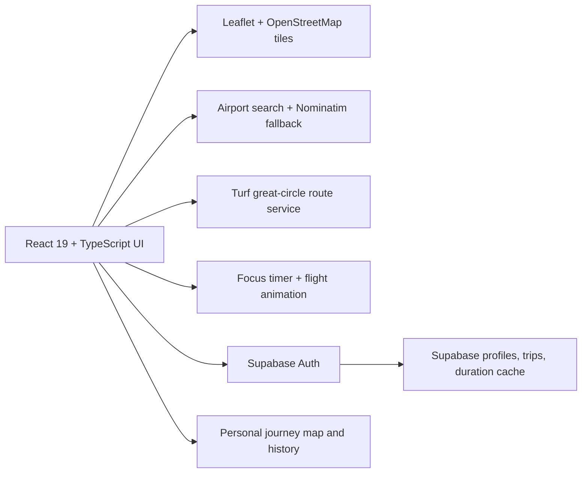

# Waypoint

> An original, map-first focus timer that turns completed study sessions into virtual flights.

[Live application](https://project-waypoint-app.vercel.app/) · [Deployment guide](docs/vercel-deployment.md) · [Product roadmap](docs/focusflight-product-expansion-roadmap.md)

Waypoint pairs a Pomodoro-style focus ritual with a real interactive map. Choose an origin and destination, begin a timed focus flight, and watch the aircraft travel a geographically grounded route while the timer counts down. Completed trips can be saved to a personal journey history through Supabase authentication.

## What is implemented

| Area             | Current capability                                                                                                                                                            |
| ---------------- | ----------------------------------------------------------------------------------------------------------------------------------------------------------------------------- |
| Interactive map  | Leaflet with OpenStreetMap-compatible tiles, panning, zooming, airport markers, and airport/city search.                                                                      |
| Flight geometry  | Turf great-circle routes, antimeridian-safe rendering, slight geographic arcs, and bearing-aware aircraft movement.                                                           |
| Focus flight     | Timer-linked aircraft progress, persistent planned route, travelled-route reveal, pause/resume, sound control, and completion state.                                          |
| Route data       | Curated airport search with Nominatim fallback, Haversine distance, realistic direct-flight duration cache, and transparent estimates when a sourced duration is unavailable. |
| Personal journey | Supabase email authentication, editable profile, saved solo trips, latest-destination landing restoration, and a personal journey map.                                        |
| Deployment       | Vite single-page application deployed on Vercel with direct-route support for `/journey`.                                                                                     |

## How a solo focus flight works

1. Start on the landing map, which centres on New York for guests and new users.
2. Select an origin and destination. Neither airport is selected by default.
3. Waypoint calculates route geometry, distance, and a duration from the flight-duration cache or a clearly labelled estimate.
4. Start the focus flight. The timer controls both the route reveal and the aircraft position.
5. Pause and resume without losing the active trip state. When the timer reaches zero, the aircraft reaches the destination.
6. Sign in to save completed journeys, profile information, and trip history.

## Product principles

- **Focus first.** The flight layer is a motivating narrative around a real focus session, not a substitute for the timer.
- **Real geography.** Routes use longitude/latitude great-circle coordinates rather than arbitrary screen-space curves.
- **Clear provenance.** Sourced direct-flight durations and calculated estimates are labelled separately.
- **Explicit choices.** Users choose a starting point and destination; the application does not silently assign an origin.
- **Privacy by design.** Personal profile and trip data are stored with user-scoped Supabase Row Level Security policies.

## Technical architecture



| Layer                    | Main locations                                                                                                           |
| ------------------------ | ------------------------------------------------------------------------------------------------------------------------ |
| Application pages        | `client/src/pages/Home.tsx`, `client/src/pages/Journey.tsx`                                                              |
| Map components           | `client/src/components/map/FlightMap.tsx`, `client/src/components/map/JourneyMap.tsx`                                    |
| Geographic services      | `client/src/services/route.ts`, `client/src/services/geocoding.ts`, `client/src/services/airportSearch.ts`               |
| Duration and persistence | `client/src/services/flightDurations.ts`, `client/src/services/tripPersistence.ts`, `client/src/services/tripHistory.ts` |
| Supabase client and auth | `client/src/lib/supabase.ts`, `client/src/contexts/SupabaseAuthContext.tsx`                                              |
| Database migrations      | `supabase/migrations/`                                                                                                   |
| Vercel deployment        | `vercel.json`, `docs/vercel-deployment.md`                                                                               |

The repository also contains an Express/tRPC scaffold used in the development environment. The current shipped browser experience uses the Supabase client directly for authentication and personal journey persistence; Vercel publishes the Vite client bundle rather than the Express development server.

## Stack

- **Frontend:** React 19, TypeScript, Vite, Tailwind CSS 4, Wouter
- **Maps:** Leaflet, React Leaflet, OpenStreetMap-compatible tiles
- **Geography:** Turf.js great-circle routes and Haversine distance calculations
- **Backend and identity:** Supabase Auth, Postgres, and Row Level Security
- **UI:** shadcn/ui, Radix UI, Lucide icons, Framer Motion
- **Testing:** Vitest and Playwright-based browser verification scripts
- **Deployment:** Vercel

## Local development

### Prerequisites

Use Node.js 22 and pnpm 10, matching the project environment.

```bash
pnpm install --frozen-lockfile
```

Waypoint requires these browser environment variables for authenticated journeys:

```text
VITE_SUPABASE_URL=
VITE_SUPABASE_PUBLISHABLE_KEY=
```

Use values from the intended Supabase project's **Connect** dialog. The publishable key is appropriate for browser use when Row Level Security is correctly configured. Never place a Supabase `service_role` key, database password, or other elevated credential in a `VITE_` variable or commit it to the repository.

For the Manus full-stack development scaffold, additional system-provided environment values may be required by the local server runtime. Refer to the development template and do not commit `.env` files.

### Start the development server

```bash
pnpm dev
```

### Verify the project

```bash
# TypeScript
pnpm check

# Unit tests
pnpm test

# Browser smoke test
pnpm test:e2e

# Long-haul geodesic-route regression checks
pnpm test:geodesic

# Client-only Vercel build
pnpm run build:vercel
```

## Deployment

The production site is configured as a Vite single-page application on Vercel. The repository's `vercel.json` runs `pnpm run build:vercel`, publishes `dist/public`, and rewrites client routes to `index.html` so direct navigation to `/journey` works.

See the detailed [Vercel deployment guide](docs/vercel-deployment.md) for required environment variables, Supabase Auth redirect URLs, and a production verification checklist.

## Data, privacy, and security

Waypoint stores personal profiles, saved trips, and flight-duration cache records in Supabase. The application is designed around user-scoped access policies: users should only read and update their own profile and journey records.

Before any public release or new social feature, review database policies, test the authenticated and unauthenticated paths, and confirm that public browser variables contain only the Supabase project URL and publishable key. Do not treat client-side UI visibility as an access-control mechanism; enforce privacy in database policies and server-side authorization where applicable.

## Documentation

| Document                                                                   | Purpose                                                                                             |
| -------------------------------------------------------------------------- | --------------------------------------------------------------------------------------------------- |
| [Flight-duration sources](docs/flight-duration-sources.md)                 | Explains the direct-flight duration cache and estimate policy.                                      |
| [Vercel deployment](docs/vercel-deployment.md)                             | Documents the static Vercel build, environment variables, and Supabase Auth URL configuration.      |
| [Product expansion roadmap](docs/focusflight-product-expansion-roadmap.md) | Planning-only roadmap for profiles, leaderboards, group flights, social features, and public pages. |
| [Public-information pages plan](docs/focusflight-public-pages-planning.md) | Planning-only outline for future About, feedback, changelog, Privacy Policy, and Terms pages.       |

## Roadmap status

The current released experience includes the solo flight ritual, personal trip history, password recovery, Google sign-in, public profiles, location-privacy controls, Co-Focus rooms, group-flight history, optional solo-location sync offers, friendships and blocking, separate Solo and Co-Focus leaderboards, public information pages, and crawl-ready launch content. The historical planning documents remain in the repository as product context.

## Contributing and open-source status

The repository is public and maintained as an independent project. Contributions should follow a future contributor guide and security reporting policy; avoid sharing secrets or production-only data in issues, pull requests, or commits.

The package metadata currently identifies the project as `MIT`; add a root `LICENSE` file before representing the repository as publicly licensed.

## Attribution

Waypoint uses Leaflet and OpenStreetMap-compatible map data. Respect all third-party provider attribution, availability, and usage policies when replacing tiles, geocoding, or airport-data providers.

## Disclaimer

Waypoint is an independent project and is not affiliated with PomoFlight, any airline, or any aviation booking service. Flight durations are used for focus-simulation purposes and should not be treated as live schedules, travel advice, or booking information.
